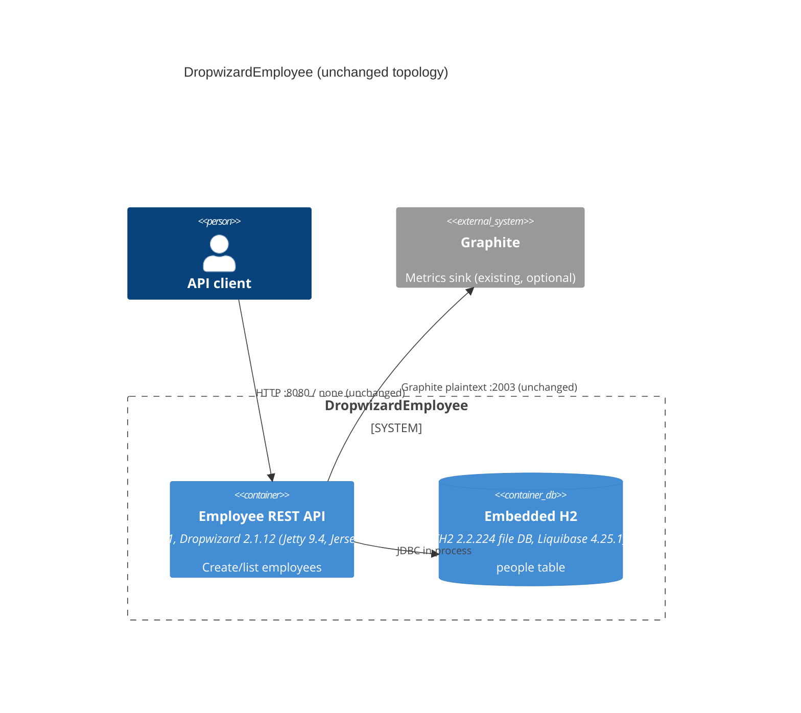

# 0001. Upgrade runtime to Java 11 and framework to Dropwizard 2.1.12

- **Status:** Proposed
- **Date:** 2026-09-24
- **ARB ticket:** TO BE CREATED
- **Authors:** Devin (on behalf of the requesting engineer)
- **Owning team:** TBD — owner to confirm before ARB
- **Related ADRs:** none

## Context

DropwizardEmployee is a single Dropwizard REST service (`/employee` POST/GET) backed by an embedded
H2 database managed through Liquibase migrations. The build targeted Java 1.6 bytecode on
Dropwizard 1.0.5 (Jetty 9.3, Hibernate 5.1, Jackson 2.8, Liquibase 3.x). Java 6 is out of support,
JDK 11+ compilers deprecate `-source 6`, and Dropwizard 1.0.x does not support running on Java 11
(it predates JEP 320's removal of JAXB/JAF from the JDK and the Jetty/Hibernate fixes for Java 9+).

The change bumps the language/runtime (Java 6 -> 11) and the application framework major version
(Dropwizard 1.0 -> 2.1). No new services, data stores, vendors, integrations, endpoints, or
auth/network boundaries are introduced.

ARB triggers: T7 (runtime/language major upgrade Java 6 -> 11; framework major upgrade
Dropwizard 1.0.5 -> 2.1.12). Not triggered: T1, T2, T3, T4, T5, T6, T8, T9.

## Decision

We will compile with `--release 11`, require JDK 11+ at build time (maven-enforcer
`requireJavaVersion`), and move to Dropwizard 2.1.12 (Jetty 9.4.53, Jersey 2.41, Jackson 2.13.5,
Hibernate ORM 5.6.15, Hibernate Validator 6.2.5, Liquibase 4.25.1, H2 2.2.224) using the
`dropwizard-bom` + `dropwizard-dependencies` BOMs, keeping the `javax.*` namespace and the classpath
(no JPMS).

## Alternatives considered

| Alternative | Pros | Cons | Why rejected |
| --- | --- | --- | --- |
| Do nothing | No effort | Java 6 target unsupported; Dropwizard 1.0.5 unsupported on Java 11 and has known CVEs | Blocks running on a supported JDK |
| Java 11 with Dropwizard 1.3.x | Smaller API jump | 1.3.x is EOL; older Jetty/Jackson/Hibernate lines | Leaves the service on an unmaintained framework line |
| Dropwizard 3.x/4.x | Newest line | 4.x requires Java 11+/Jakarta EE namespace and 17 is preferred; larger code/config change | Out of scope for a Java 11 migration; can be a follow-up |

## Architecture

## Non-functional requirements

| NFR | Target | How met |
| --- | --- | --- |
| Availability SLO | TBD — owner to confirm before ARB | Unchanged topology |
| p95 latency | TBD — owner to confirm before ARB | Unchanged |
| RPO / RTO | TBD — owner to confirm before ARB | Unchanged (local H2 file) |
| Peak load | TBD — owner to confirm before ARB | Unchanged |
| Scaling model | Single process | Unchanged |
| Data retention | Unchanged | Unchanged |

## Security & compliance

- **Data classification:** Unchanged (employee name/job title).
- **Encryption at rest:** Unchanged (none; local H2 file).
- **Encryption in transit:** Unchanged (HTTP; HTTPS/h2 connectors remain commented out in `example.yml`).
- **AuthN / AuthZ:** Unchanged (none).
- **Secrets:** Unchanged.
- **Audit logging:** Unchanged.
- **Data residency / regions:** N/A — no cloud infrastructure.
- **Policy sections satisfied:** N/A — no infrastructure/CDK in this repo.
- **Threats considered:** Upgrading removes a large set of known CVEs in Jetty/Jackson/Hibernate/H2 of the 1.0.5 dependency tree.

## Cost

| Item | Assumption | Monthly estimate |
| --- | --- | --- |
| Runtime | Same single process | $0 change |
| **Total** | | $0 change |

## Operations

- **On-call rotation:** TBD — owner to confirm before ARB
- **Runbook:** README.md (build/migrate/run commands unchanged)
- **Dashboards / alarms:** Unchanged (Graphite reporter)
- **Rollback plan:** Revert the PR and redeploy the previous jar on the previous JDK.
- **Migration / cut-over plan:** Hosts must run JDK 11+. H2 1.4 -> 2.x file format is not compatible; existing `target/example*.db` files must be recreated with `db migrate` (the README flow already does this).

## Policy exceptions requested

| Rule | Resource | Justification | Compensating control | Expiry |
| --- | --- | --- | --- | --- |
| none | | | | |

## Consequences

- Positive: builds and runs on Java 11; supported framework line with current dependency patches.
- Negative / risks: H2 on-disk format change; `viewRendererConfiguration` key renamed from `.ftl` to `freemarker`.
- Follow-ups: consider Dropwizard 4.x / Java 17 separately.

## Open questions

- Owning team, NFR targets and on-call rotation for this service.
